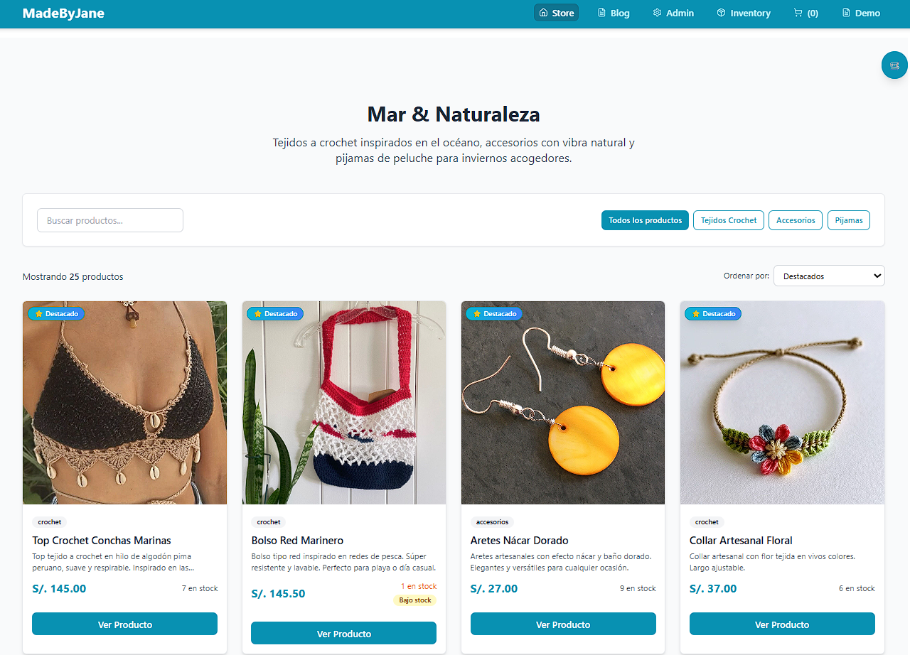
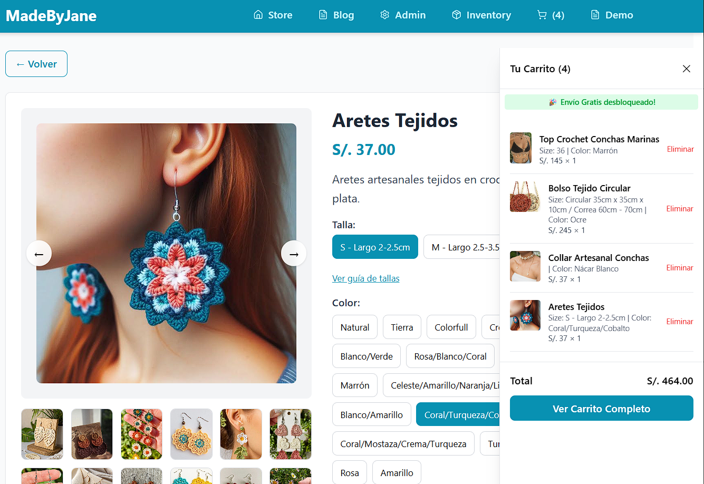
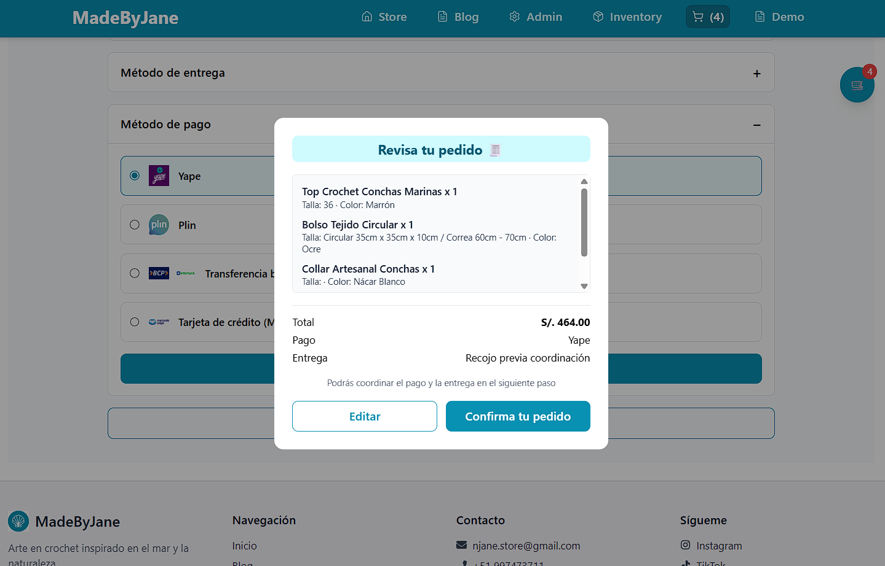

# 🏗️ MadeByJane - E-commerce Fullstack (Frontend MVP en producción)

<div align="center">


[](https://vercel.com)


[](https://nodejs.org/)
[](https://expressjs.com/)
[](https://www.postgresql.org/)

*"A beautiful e-commerce platform for handmade crochet and natural accessories"*
</div>

## **🎯 Descripción del Proyecto**

Aplicación e-commerce desarrollada con React para la venta de productos artesanales, enfocada en experiencia de usuario, lógica de negocio real y escalabilidad.

<div align="center">

### 🔗 Demo en Producción: [MadeByJane](https://madebyjane.vercel.app/)

*Catálogo interactivo • Carrito funcional • 100% Responsive*
### 📋 Tablero: [GitHub Projects](https://github.com/users/NellyCN/projects/4)

</div>

## 📸 **Vista previa**

### 🏠 Home


### 🛒 Carrito


### 💳 Checkout


## ✅ **Funcionalidades**
- **Catálogo de productos** con filtros y búsqueda
- **Vista detalle de producto** con tablas de tallas personalizadas
- **Carrito de compras** con lógica de negocio:
  - Cálculo automático de IGV
  - Envío condicional (gratuito sobre X monto)
  - Resumen en tiempo real
- **Flujo de checkout modular** listo para integración backend
- **Diseño 100% responsive** (mobile-first)
- **Gestión ágil** con Kanban en GitHub Projects

## **🚧 Estado actual**

Frontend en producción. Backend en desarrollo (Node.js + Express + PostgreSQL).

---

## 🛠️ Stack Tecnológico

### Frontend (En producción)
- React 18 + Vite
- Tailwind CSS
- React Router DOM para navegación SPA
- Context API + Hooks 
- Vercel (deploy)

---

## 📊 Gestión del Proyecto

Este proyecto es un **ejemplo de desarrollo ágil aplicado**:
- **Tablero Kanban** con [GitHub Projects](https://github.com/users/NellyCN/projects/4) (backlog, sprints, milestones)
- **Priorización basada en impacto de negocio** (ej: tablas de tallas antes que features decorativas)
- **Ciclos de feedback continuo** y mejora iterativa
- **Control de versiones** con Git y convenciones de commits

---

## 🧠 Enfoque del proyecto

### 1. **Experiencia de Usuario Centrada en Conversión**
- Tablas de tallas específicas por tipo de producto para reducir devoluciones.
- Transparencia de precios: el IGV se calcula y muestra explícitamente.
- Lógica de envíos clara (gratis sobre X monto).

### 2. **Arquitectura Escalable**
- Componentes React modulares y reutilizables.
- Estructura de carpetas clara (`/components`, `/context`, `/pages`, etc.)
- Preparado para integración con backend (servicios separados).

### 3. **Calidad de Código**
- ESLint configurado para buenas prácticas.
- Código comentado en secciones críticas.
- **Diseño responsive probado en múltiples dispositivos:**

---

## 🏃‍♀️ Cómo Ejecutar Localmente

```bash
# 1. Clonar el repositorio
git clone https://github.com/NellyCN/madebyjane-store.git
cd madebyjane-store/frontend

# 2. Instalar dependencias del frontend
npm install

# 3. Ejecutar entorno de desarrollo
npm run dev

# 4. Abrir en el navegador
 http://localhost:5173

```
> Nota: El backend y la base de datos están en desarrollo. Actualmente solo el frontend está ejecutable.

---
## 📂 Estructura del Proyecto

```
madebyjane-store/
├── frontend/ # Aplicación React + Tailwind CSS (en producción)
│    ├── public/ # Assets estáticos
│    ├── src/
│    │    ├── components/ # Componentes reutilizables
│    │    ├── constants/ # Constantes de la app (routes, config)
│    │    ├── context/ # Estado global (CartContext)
│    │    ├── data/ # Datos mock (productos, categorías)
│    │    ├── hooks/ # Custom hooks
│    │    ├── layout/ # Componentes de layout (Header, Footer)
│    │    ├── pages/ # Vistas principales (Store, ProductDetail, Cart)
│    │    ├── services/ # Futuros servicios para API
│    │    └── ...
│    └──  README-frontend.md # 📖 Guía específica del frontend
│  
├── backend/ # Próxima implementación 
│    ├── src/
│    ├── pom.xml
│    ├── README.md # 📖 Guía específica del backend
│    └── package.json
├── database/ # Esquemas y migraciones PostgreSQL
│    └── schema.sql 
└── README.md 

```

---

## 👩‍💻 Autora & Motivación

**Nelly Cumpa**  
*Full-Stack Developer & Technical Project Lead*

Este proyecto representa mi transición profesional: **15+ años en operaciones financieras** (créditos, cobranzas, optimización de procesos) + **desarrollo full-stack moderno**.

La construcción de "MadeByJane" demuestra mi capacidad para:
- **Liderar un producto digital** desde la concepción hasta el despliegue.
- **Tomar decisiones técnicas basadas en necesidades de negocio**.
- **Aplicar metodologías ágiles** en un proyecto real.
- **Aprender y adaptar** nuevas tecnologías para resolver problemas concretos.

---

## 📬 Contacto y Colaboración
Este proyecto es parte de mi portafolio profesional y un caso de estudio activo.

¿Interesado en colaborar, dar feedback o conversar sobre desarrollo full-stack?


---

<div align="center">

✨ Sigue el viaje de desarrollo

Próximamente: Backend, base de datos y pasarela de pago ✨

</div>